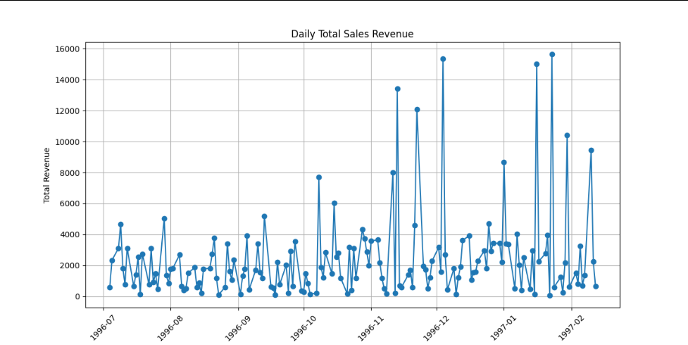

# Kiwilytics Data Pipeline Project 🚀

## 📌 Overview

This project implements an **end-to-end data pipeline using Apache Airflow** to analyze daily sales revenue from a PostgreSQL database.

The pipeline automates the full workflow from data extraction to visualization.

---

## ⚙️ Pipeline Architecture

The pipeline is orchestrated using a **DAG (Directed Acyclic Graph)** with three main tasks:

### 1. Data Extraction (Fetch Order Data)

* Connects to PostgreSQL using Airflow hooks
* Extracts order, product, and sales data
* Stores raw data as CSV

### 2. Data Transformation (Daily Revenue Calculation)

* Reads raw dataset
* Calculates total revenue:

  * `total_revenue = quantity × price`
* Aggregates revenue per day
* Outputs processed dataset

### 3. Data Visualization

* Reads processed data
* Generates time series plot of daily revenue
* Saves output as an image

---

## 🔄 Workflow (DAG)

The pipeline follows this execution order:

fetch_order_data → process_daily_revenue → plot_daily_revenue

* Each task is independent and reusable
* Ensures automation and scalability
* Runs on a **daily schedule**

---

## 📊 Visualization Output



This chart shows the trend of total sales revenue over time.

---

## 📂 Project Structure

* `pipeline_dag.py` → Airflow DAG definition
* `daily_sales_data.csv` → Raw extracted data
* `daily_revenue.csv` → Processed data
* `daily_revenue_plot.png` → Final visualization

---

## 🧰 Tools & Technologies

* Apache Airflow (workflow orchestration)
* PostgreSQL (data source)
* Python
* Pandas (data processing)
* Matplotlib (visualization)

---

## ▶️ How to Run

1. Set up Airflow and PostgreSQL connection:

   * Configure connection ID: `postgres_conn`

2. Place the DAG file in Airflow DAGs folder

3. Start Airflow scheduler and webserver

4. Trigger the DAG:

```bash id="y7k2lp"
airflow dags trigger daily_sales_revenue_analysis
```

---

## 🎯 Key Features

* Automated ETL pipeline
* DAG-based workflow orchestration
* Database integration using Airflow hooks
* Daily scheduled execution
* End-to-end data processing

---

## 🚀 Key Highlights

* Real-world data pipeline implementation
* Strong data engineering concepts
* Scalable workflow design
* Business-focused output (revenue analysis)

---

## 📈 Outcome

This project demonstrates the ability to:

* Build and orchestrate data pipelines
* Work with databases in production-like workflows
* Transform raw data into actionable insights
* Automate analytics processes

